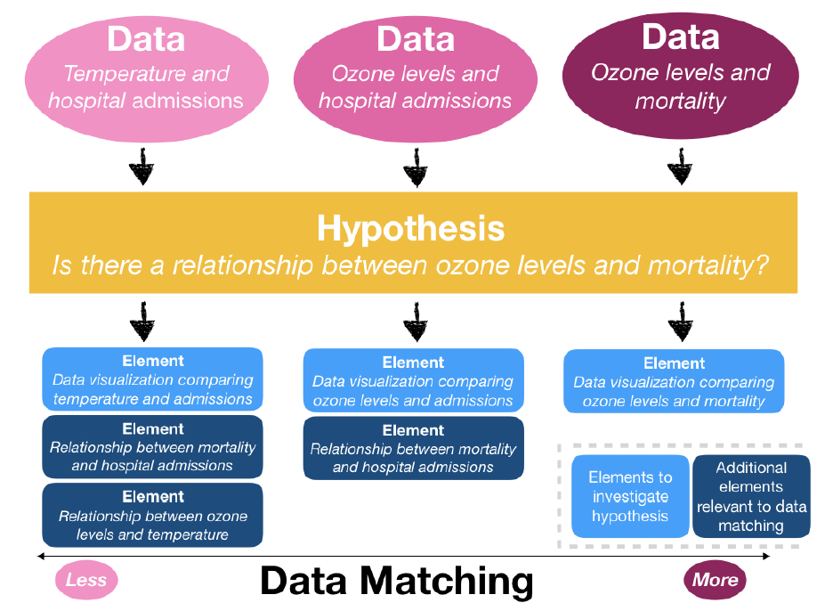
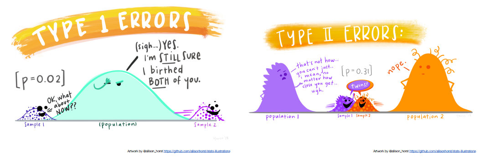
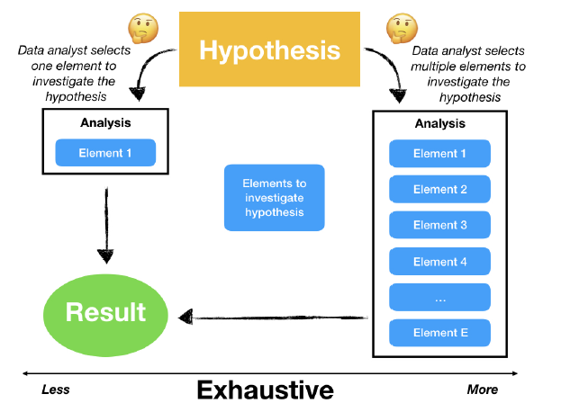
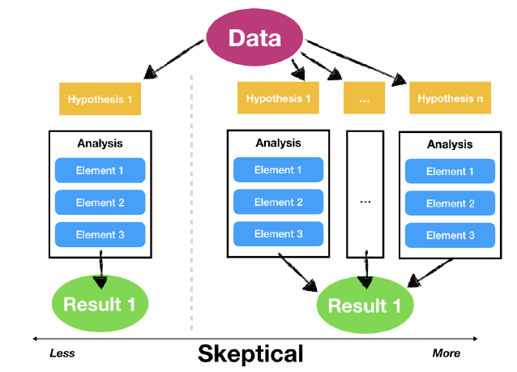
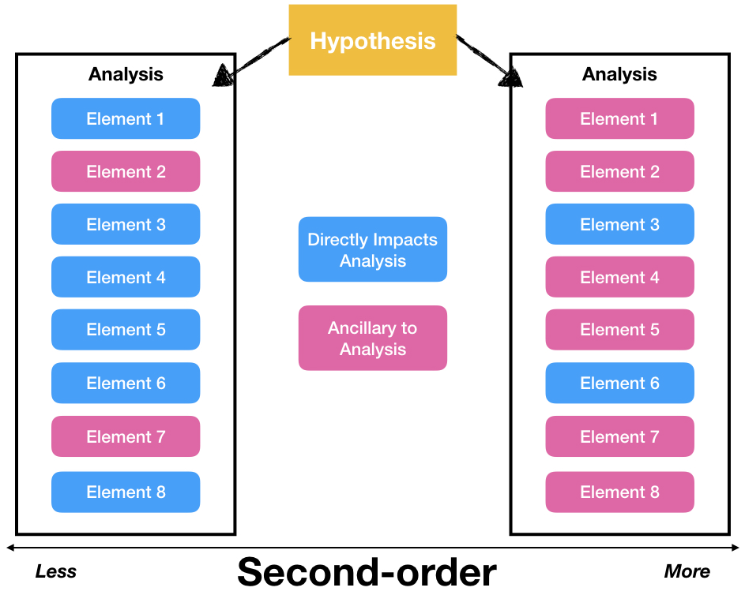
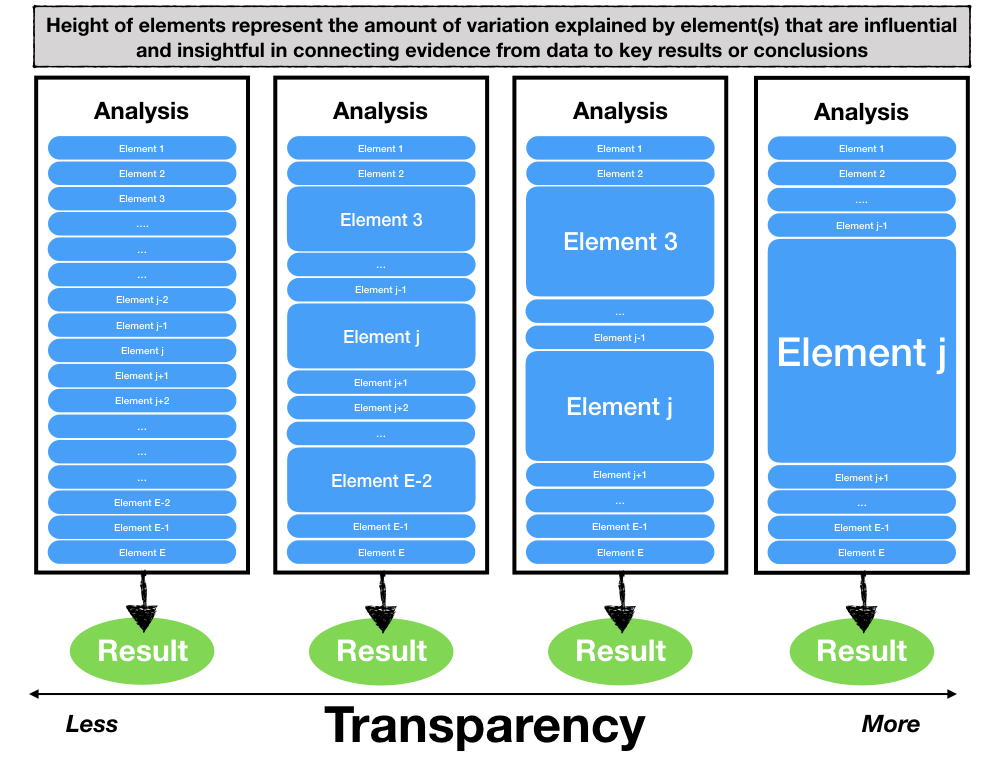
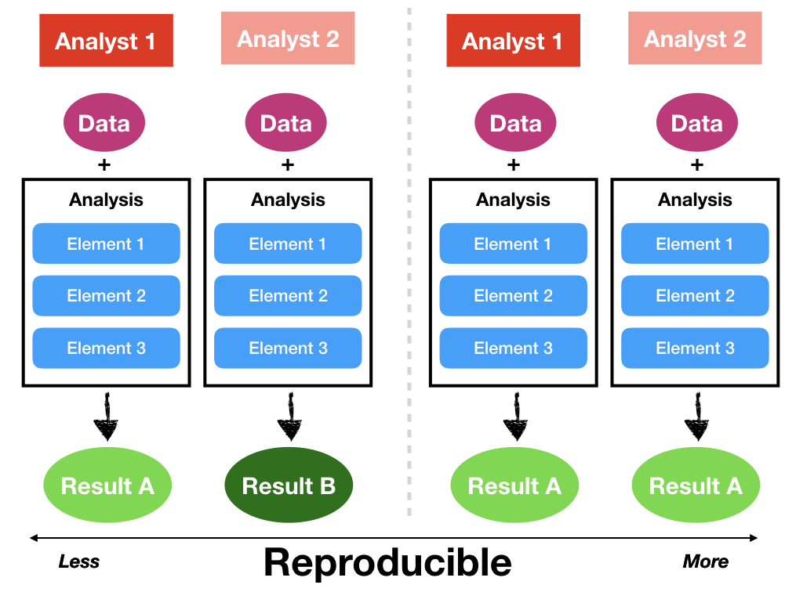
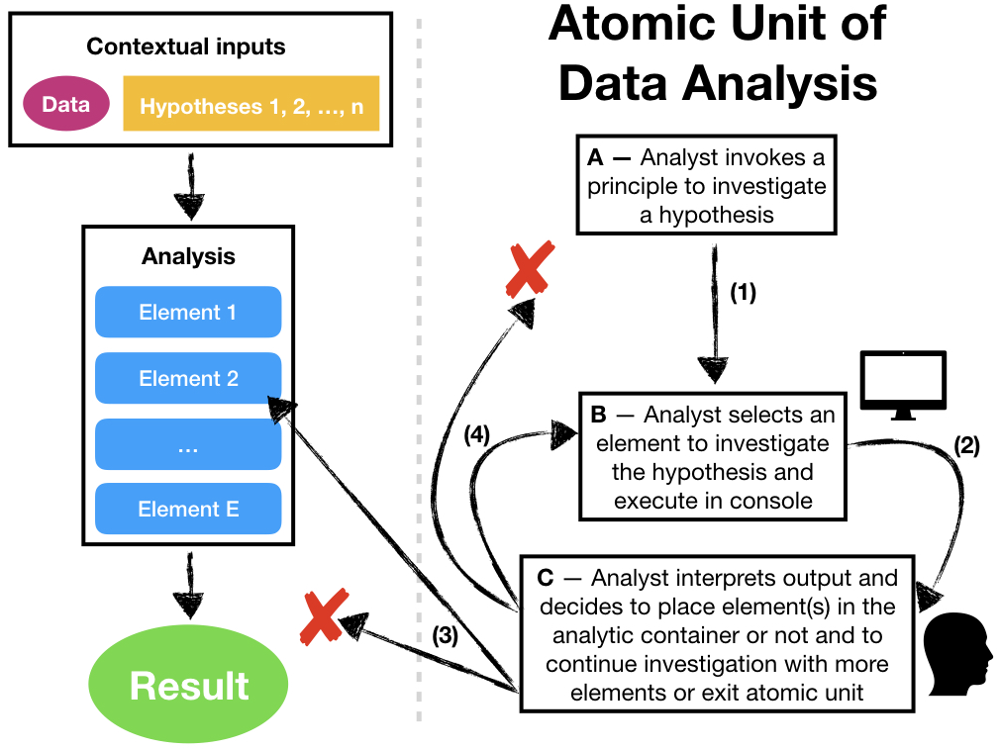

## Introduction

> Data science is the science and design of (1) actively creating a question to investigate a hypothesis with data, (2) connecting that question with the collection of appropriate data and the application of appropriate methods, algorithms, computational tools or languages in a data analysis, and (3) communicating and making decisions based on new or already established knowledge derived from the data and data analysis.
>
> `r tufte::quote_footer('--- Stephanie C. Hicks and Roger D. Peng, 2019')`

> Data analysis is the investigative process used to extract knowledge,
information, and insights about reality by examining data.

>
> `r tufte::quote_footer('--- Grolemund and Wickham, 2014')`

- [50 Years of Data Science](http://courses.csail.mit.edu/18.337/2015/docs/50YearsDataScience.pdf)

- [Data	Science:	A	Three	Ring	Circus	or	a	Big	Tent?](https://arxiv.org/ftp/arxiv/papers/1712/1712.07349.pdf)

- [Elements and Principles of Data Analysis](https://arxiv.org/pdf/1903.07639v1.pdf)

- [Data Science is difference now](http://veekaybee.github.io/2019/02/13/data-science-is-different/)

## Introduction - Elements of Data Analysis

> The elements of a data analysis are the fundamental components of a data analysis used by the data analyst: code, code comments, data visualization, non-data visualization, narrative text, summary statistics, tables, and statistical models or computational algorithms.
>
> `r tufte::quote_footer('--- Breiman, 2001')`

```{r echo=FALSE, message=FALSE,,warning=FALSE}
library(readxl)
library(dplyr)
# library(ggplot2)
data=read_excel("program.xlsx",sheet="elements")
library(knitr)
library(kableExtra)
data %>%
  kbl() %>%
#  kable_classic(full_width = F, html_font = "Cambria")
  kable_paper(bootstrap_options = "striped", full_width = F,font_size = 22)
#kable(data, booktabs = TRUE)
```


## Principles of Data Analysis - Data Matching

<div class='left' style='float:left;width:48%'>

 - Data analyses with high data matching have data readily measured or available to the analyst that directly matches the data needed to investigate a hypothesis or problem with data analytic elements. In contrast, a hypothesis may concern quantities that cannot be directly measured or are not available to the analyst. 


- Data matching (also known as record or data linkage, entity resolution, object identification, or field matching) is the task of identifying, matching and merging records that correspond to the same entities from several databases or even within one database.


</div>
<div class='left' style='float:left;width:48%'>


```{r, echo=FALSE, out.width="100%", fig.cap="", fig.align = 'center'}

```
</div>


## Principles of Data Analysis - Exhausive

<div class='left' style='float:left;width:48%'>

- An analysis is exhaustive if specific questions or hypotheses are addressed using
multiple, complementary elements


- As a result, the combination of elements used may provide a more complete picture of the evidence in the data than any single element.

```{r, echo=FALSE, out.width="100%", fig.cap="", fig.align = 'center'}

```

</div>
<div class='left' style='float:left;width:48%'>

```{r, echo=FALSE, out.width="100%", fig.cap="", fig.align = 'center'}

```

</div>

## Principles of Data Analysis - Skeptical


- An analysis is skeptical if multiple, related hypotheses or alternative explanations of observed phenomena are considered using the same data and offer consistency of the data with these alternative explanations. In contrast, analyses that do not consider alternate explanations have no skepticism.

```{r, echo=FALSE, out.width="50%", fig.cap="", fig.align = 'center'}

```

## Principles of Data Analysis - 2nd Order


- An analysis is second-order if it includes ancillary elements that do not directly address the primary hypothesis/question but give important context to the analysis.

```{r, echo=FALSE, out.width="40%", fig.cap="", fig.align = 'center'}

```

## Principles of Data Analysis - Transparency

<div class='left' style='float:left;width:48%'>

- Transparent analyses present an element or set of elements summarizing or visualizing data that are influential in explaining how the underlying data phenomena or data-generation process connects to any key output, results, or conclusions.


- While the totality of an analysis may be complex and involve a long sequence of
steps, transparent analyses extract one or a few elements from the analysis that summarize or visualize key pieces of evidence in the data that explain the most “variation” or are most influential to understanding the key results or conclusion.

</div>
<div class='left' style='float:left;width:48%'>

```{r, echo=FALSE, out.width="100%", fig.cap="", fig.align = 'center'}

```

</div>


## Principles of Data Analysis - Reproducible

<div class='left' style='float:left;width:48%'>

- An analysis is reproducible if someone who is not the original analyst can take the published code and data and compute the same results as the original analyst.

- Critical to reproducibility is the availability of the analytic container
to others who may wish to re-examine the results.

- Reproducibility also speaks to the coherence of the workflow in the analysis in that the workflow should show how the data are transformed to eventually become results.

</div>
<div class='left' style='float:left;width:48%'>

```{r, echo=FALSE, out.width="100%", fig.cap="", fig.align = 'center'}

```


</div>


## Principles of Data Analysis - Atomic

<div class='left' style='float:left;width:48%'>

- the data analyst first chooses a principle to investigate a hypothes is
or scientific question (Stage A).

- the analyst alternates between Stages B and C until the analyst exits the atomic unit, either by choosing to end the line of investigation or choosing to invoke a new principle.

</div>
<div class='left' style='float:left;width:48%'>

```{r, echo=FALSE, out.width="100%", fig.cap="", fig.align = 'center'}

```


</div>

## Understanding Your Data (1)

**[Data Science Foundations: Know your data. Really, really know it](https://towardsdatascience.com/data-science-foundations-know-your-data-really-really-know-it-a6bb97eb991c).**

> Your colleagues in business, despite not being data people, aren’t idiots of any sort (hopefully). They’re domain experts that know tons about the business. Don’t be the junior analyst presenting a brilliant new finding to the CEO that gets asked "so did you take out the 3 special high volume contract accounts we have?”, doesn’t end well.

```{r, echo=FALSE, out.width="80%", fig.cap="", fig.align = 'center'}
url <- "https://miro.medium.com/max/875/1*MmmBLiC7GACdZWwZFykoqQ.png"
knitr::include_graphics(url)
#knitr::include_graphics("../Visual/data-atomic.png")
```


## Understanding Your Data (2)

<div class='left' style='float:left;width:48%'>

- Know the data layout
- Know your data records
- Know of business data quirks
- Know where the data comes from, how it’s generated and defined
- Know the collection decisions being made

<span style="color: red;"> You’re never going to have perfect data nor perfect understanding of all your data. Just when you think you’ve mastered something, a new feature has been added, standards change, systems are retired. Just **keep learning**, document what you can, leave paper trails for your analyses and just keep going.</span>


</div>
<div class='left' style='float:left;width:48%'>


```{r, echo=FALSE, out.width="100%", fig.cap="", fig.align = 'center'}
url <- "https://miro.medium.com/max/865/1*X1n4WeN_cWohvxRkeVCPMQ.png"
knitr::include_graphics(url)
#knitr::include_graphics("../Visual/data-atomic.png")
```

</div>


## Data Bias

<div class='left' style='float:left;width:48%'>

[Caroline Criado-Perez On Data Bias And 'Invisible Women'](https://www.npr.org/2019/03/17/704209639/caroline-criado-perez-on-data-bias-and-invisible-women)


<iframe src="https://www.npr.org/player/embed/704209639/704209640" width="90%" height="180" frameborder="0" scrolling="no" title="NPR embedded audio player"></iframe>


<div class='left' style='float:left;width:48%'>
```{r, echo=FALSE, out.width="100%", fig.cap="", fig.align = 'center'}
url <- "https://i.gr-assets.com/images/S/compressed.photo.goodreads.com/books/1617113740i/41104077._UY473_SS473_.jpg"
knitr::include_graphics(url)
```
</div>
<div class='left' style='float:left;width:48%'>
```{r, echo=FALSE, out.width="68%", fig.cap="", fig.align = 'center'}
url <- "https://api.time.com/wp-content/uploads/2016/08/weapons-of-math-destruction.jpeg"
knitr::include_graphics(url)
```
</div>

</div>
<div class='left' style='float:left;width:48%'>

```{r, echo=FALSE, out.width="90%", fig.cap="", fig.align = 'center'}
url <- "https://productiveclub.com/wp-content/uploads/2020/07/sampling-bias.jpeg"
knitr::include_graphics(url)
```
</div>


